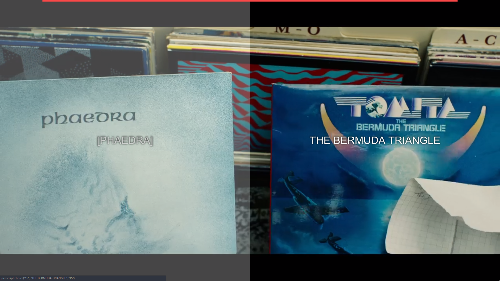
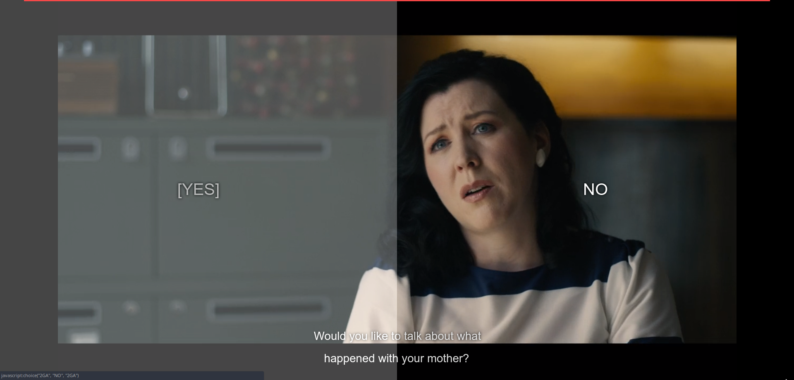

# Bandersnatch Интерактивен плеър (базиран върху html5 видео плеър)

С този онлайн (html) видео плеър you може да гледате епизода`Bandersnatch` от `Black Mirror` **Интерактивно**.

[Демо](https://kockof.github.io/bandersnatch/)

## Как се използва

Единствено ви трябва 5 часовия видео файл `Bandersnatch`, Плъзнете & пуснете файла [в тази](https://kockof.github.io/bandersnatch) страница и се наслаждавайте!
## Снимки

- full screen режим

- нормален режим 
- 

## Съвети

- Работи с Google Chrome и Microsoft Edge (Не работи с Firefox; проблеми с кодеците)
- Свалете видео файла`Bandersnatch` (`5:12:14`)
- Плъзнете го до [страницата](https://kockof.github.io/bandersnatch/) :)
- `Persian`, `English`, `Bulgarian`, `Spanish`, `Hebrew`, `Portuguese`, `Greek`, `Turkish`, `Polish`, `Indonesian`, `Russian` , `French` , `Hungarian` , `Korean` ,`German`

\*налични субтитри, ако имате други файлове със субтитри мога да ги добавя.

- За смяна на субтитрите: : Десен бутон върху видеото , Изберете "Покажи всички контроли" , Нтиснете долу в дясно трите ветикални точки и може да изберете субтитрите
- Бележка: не използвайте бутона "full screen" на плеъра ако е включено "Покажи всички контроли".
									Няма да се виждат менютата с изборите.

## Управление

- <kbd>F</kbd> - Пуска и спира fullscreen
- <kbd>R</kbd> - Рестартира видеото
- <kbd>→</kbd> - Прескача  до следващ момент от изборите в интерактивните менюта
- <kbd>←</kbd> - Прескача  до предишен момент от изборите в интерактивните менюта
- <kbd>Space</kbd> - Поставя видеото на пауза

## Заслуги

- based on [joric work](https://github.com/joric/bandersnatch) and [mehotkhan work](https://github.com/mehotkhan/BandersnatchInteractive)
